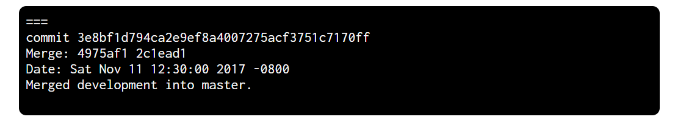

# Gitlet Design Document

**Name**: Susie

## Classes and Data Structures
* The basic structure of .git . Learned the information stored in different files. Screenshot from helper video.


<<<<<<< HEAD
* .gitlet/
  - objects/
    - blob/
    - commits/
  - refs
    - heads
      - master/main  store sha1 id
      - other branches
    - remote
  - stages/same as index in git
  - HEAD  :a pointer, stores a path to tell git where is the HEAD commit
=======
<!-- nit(nitpicking)
generated by using [`tree`](https://linuxconfig.org/how-to-print-directory-tree-using-linux)
ref: https://sp21.datastructur.es/materials/proj/proj2/proj2#understanding-integration-tests -->
```
.
├── .gitlet
│   ├── HEAD                      <==== a pointer stores a path to tell git where is the HEAD commit
│   ├── objects
│   │   ├── blob
│   │   └── commits
│   ├── refs
│   │   ├── heads
│   │   │   ├── master
│   │   │   │   └── main          <==== store sha1 id
│   │   │   └── other_branches    <==== avoid space in any pathes
│   │   └── remote
│   └── stages                    <==== same as index in git

```

<!-- use `` to wrap any thing you think it has something to do with code or CLI (Command Line Interface). -->

>>>>>>> 1169f9aeb83e190567c284318edcb3273729ffdc

### Class 1: Repository
Ensure the structure of gitlet, and created the persistence.

#### Fields

* Files followed by the structures

#### Methods:
1. `setUp()` - follow the directory and file structure, set up the .gitlet
file.


### Class 2: Gitlet
<!-- nit: no point to put two // here -->
Wrap all the gitlet command into this class. Consists of all basic gitlet command methods. 
#### Fields:
1. files and directory from the Repository class
2. currBranch record the current branch of gitlet command
3. currCommit record the latest commit in the current branch

#### Methods:
1. `init()` - initial commit (need the Commit class), single master branch, set all related files and directories.

<!-- opinion: images should ALWAYS be in their own paragraph. I think you notice that, if you put one line next to the one above, the two lines will be a single paragraph after rendering (vscode shortcut: ctrl+shift+v) -->


2. `add(String filename)` - needs blobs, add stages, be careful about the rm.
<!-- double space (`  `) and `-`/`*` to create a sublist, if you don't want a sublist, remove all sapces-->
<!-- recommend: https://stackoverflow.com/questions/30140595/show-whitespace-characters-in-visual-studio-code -->
* Each file in CWD should be matched with a blob. If an existing file content changed, the new blob should be generated.
* Make sure the added file being staged for addition, so the stage class should be included in this command.
The structure of stage class, stage for addition can try to implemented by map. 

* Constraint: only one file may be added at one time.

3.  `commit(String message)` - A snapshot of the file. First clone the parent commit, then put add stage area's tracked file
 into commit or removed the tracked file in remove stage area. After commit, clear the stage area.


<!-- opinion: blockquote (`>`), instead of `//` is a better option if you really want to indicate this line is special. E.g., explain the original reference-->
> learnt from the helper video.
* Feel free to add the helper function. When implementing add and commit method, try to increase the code usage.

4. `rm (String filename)` - consider 3 different cases:  
-  If the file just be added but not being committed, it means the file is in stage for addition area. So unstaging the file in staged for addition is enough. 

-  If the file is tracked in current commit and also exist in CWD, stage it for removal and remove it in CWD. The remove process will be recorded in the next commit.

-   If the file is tracked in current commit but not exist in CWD, put the blob in staged for removal area will be enough. 
> Failed situation: If a file is neither exist in stage for addition, nor tracked by commit, meaning the file
 doesn't exist in CWD. "No reason to remove the file". 


5. `log()` - show all commit information, print all commits backwards until reaches the init commit.
> Use the for loop to print it all, until the parent commit reaches init commit. 
> If there is a merge case, print commit's first and second parent. So the commit class, a second parent field should be added. 


6. `global_log()` - similar to log method, but doesn't care about the order of commit.

7. `status()` - show the four gitlet areas' information, which are: branches, staged files, removed 
files, modifications not staged for commit and untracked files. 
Try to use four helper function, to distinguish these four cases.

8. `checkout()` - 3 different cases, try to split each situation in different helper
 method syntax.
-  First case: checkout - [filename]. Recover the file content named "filename", it is tracked by current commit.
 If the CWD doesn't exist the file with the filename, put the tracked file into CWD. Else if the file exists 
 in CWD, overwrite it by the tracked file. 
> Fail case: current commit doesn't track the file with the filename, "File does not exist in that commit."

- Second case: checkout [commitID] - [filename]. Similar to the first case, but the tracked file should be found 
in the specific commit. The specific commit is determined by commitID.
> Fail case: specific commit doesn't track the file with the filename, "File does not exist in that commit."

- Third case: checkout - [branchName]. Rename it to checkOutBranch - [branchName]. Change the HEAD pointer from pointing
to the current branch to pointing to branchName. Takes all files in the commit at the head of the given branch, and puts them in the CWD, 
overwriting the versions of the files that are already there if they exist. Also, at the end of this command, the given branch will be 
become the HEAD branch. 
> Fail case: If no branch with that name exists, "No such branch exist"; if branch is the current branch, "No need to checkout current branch";
if file in CWD is untracked in current branch and would be overwritten by checkout, "There is an untracked file in the way;
delete it, or add and commit it first". 

9. `branch(String branchName)` - creates a new pointer points to the current commit.
10. `reset(String commitID)` - checks out file tracked by the given commit, and also
 remove the head pointer to the given commit. 
11. `merge(String branch)` - the most complicated command in gitlet, only
considered merge two branches into one. Try to use more helper functions for 
debug, and created more tests after finish the method. 


### Class 3: Commit 
> learnt from the helper video, the structure can also be used in blob class each commit has its own sha1 hashcode, and message. The merged commit has the second parent. 
> The structure of commit shows in image below. 
> A snapshot of the saved files in CWD

#### Fields:
* `String message` - contains the message of the commit
* `Date timeStamp` - time at which the commit was created
* `String parent` - the parent commit of a commit object, but stored in commit object as a string, for tracking
* `String second_parent` - the merge commit's second parent, default to be empty. 
* `String sha1` - the commit id
* `File commitFileName` - the actual commit file stored under the object directory

#### Methods:

> in commit, the key of the map is the file name usually created by user, value is blob's sha1.

1. Three different constructors, match init commit, normal commit, merge commit separately.
2. `dateToTimeStamp(Date date)` - for generated the required time stamp
3. `save()` -  make commit persistency
4. `generateSha1()` - generate commit's unique sha1 code
5. `getSha1()` - get the commit's sha1
6. `getTracked()` - get the commit's tracked blobs
7. `setTracked(Map<String,String> parentTracked)` - set the initial track equals to the parent commit (clone the parent commit tracked files)
8. `addTracked(String blobFileName, String blobSha1)` - add more blob's tracked
9. `untracked(String blobFileName)` 
10. `getParent()`
11. `getSecond_parent()`
12. `getTimestamp()`
13. `getMessage ()`

After the commit command, the .gitlet looks like:


### Class 4: Blob
> Another object, the structure is similar to Commit, but 
easier to construct. For each blob object, blob's filename is blob sha1, content is the bytes

#### Fields
1. `String hash` - blob id
2. `byte[] fileContents` - contents stored in blob
3. `File filename` - normally same as the file in working directory
4. `File blobFileName` - the blob file stored under object directory


#### Methods:
1. `generateHash()` - generate the blob sha1 hash code
2. `getHash()` - get the hashcode of blob
3. `getContents()` - get the content of blob in byte
4. `saveBlob()` - make blob persistency in file


### Class 5: Stage
> Learned from the helper video and slides, after the commit, 
the staging area looks like:


#### Fields:
1. `Map<String, String> addStage` - add stage area, stores the blob filename and blob's sha1
2. `List<String> removeStage` - remove stage area, stores the filename of blob will be removed.


#### Methods:
1. `stageForAddition(String file, String blobID)` - put the blob file into the add stage area
2. `stageForRemoval(String filename)` - put the removed blob filename into removal stage area
3. `stageForAdditionUpdateBlob(String file, String blobID)` - when file modified in CWD, after using add command, it will update the stage for addition area
4. `getAddStage()` - get the map of stage for addition
5. `getRemoveStage()` - get the removal stage area contents
6. `clear()` - clear the stage area
7. `remove(String filename)` - for rm command
8. `save()` - save the stage for persistent.


## Algorithms
* BFS - implemented in merge method, for traversing the commit graph to find the split point.


## Persistence
* All command requires the file stages or new created object to be saved. 
