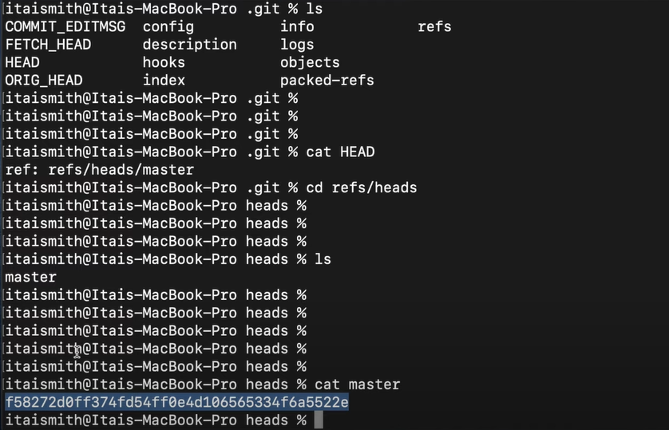
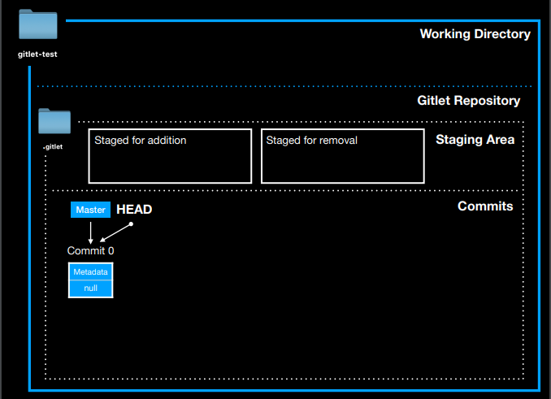
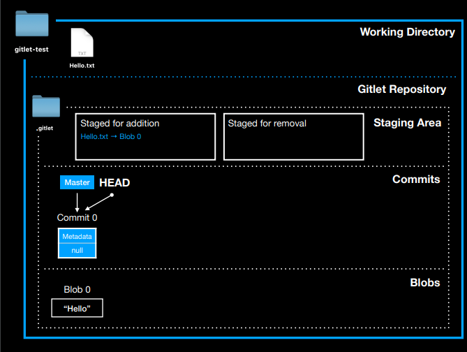
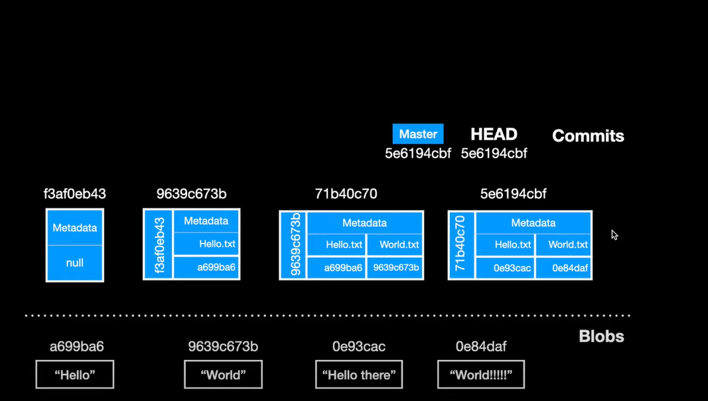
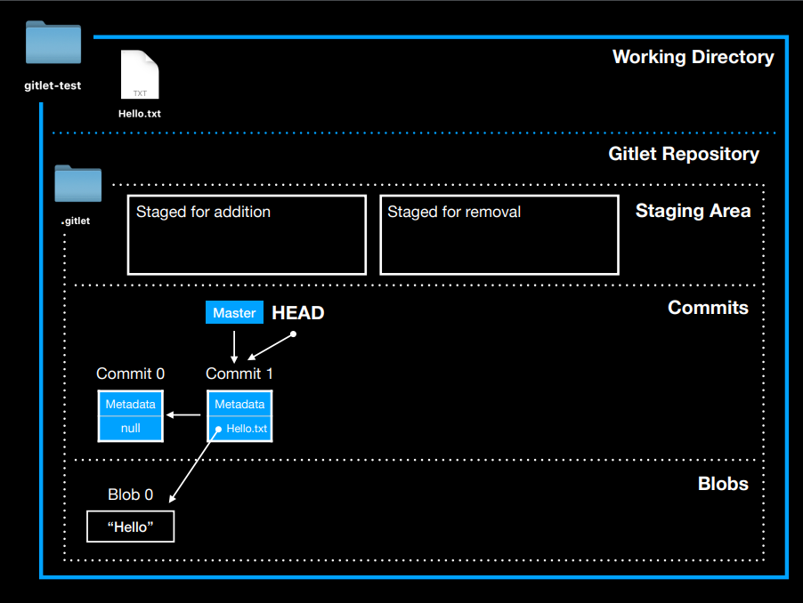
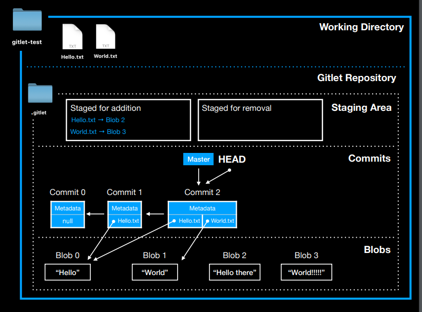

# Gitlet Design Document

**Name**: Susie

## Classes and Data Structures

* .gitlet/
  - objects/
    - blob/
    - commits/
  - refs
    - heads
      - master/main  store sha1 id
      - other branches
    - remote
  - stages/same sa index in git
  - HEAD  :a pointer, stores a path to tell git where is the HEAD commit

### Class 1: Repository
ensure the structure of gitlet, and created the persistence.

#### Fields

* Files followed by the structures

#### Methods:
1. setUp() - follow the directory and file structure, set up the .gitlet
file.

### Class 2: Gitlet
// wrap all the gitlet command into this class.
#### Fields:
1. files and directory from the Repository class
2. currBranch record the current branch of gitlet command
3. currCommit record the latest commit in the current branch

#### Methods:
1. init() - initial commit (need the Commit class), single master branch, set all related files and directories.
 

2. add(String filename) - needs blobs, add stages, be careful about the rm.  
* only one file may be added at one time.

 make sure the added file being staged for addition

3.  commit(String message) - clone the parent commit, then put add stage area's tracked file
 into commit or removed the tracked file in remove stage area. After commit, clear the stage area.
  
  //learnt from the helper video.
* feel free to add the helper function. 

4. rm (String filename) - 3 different cases, unstage the file if it is currently in staged for addition. If the file is
tracked in current commit, stage it for removal and remove it in CWD

5. log() - show the information of commit
6. global_log() - similar to log method, but doesn't care about the order of commit.
7. status() - show the four gitlet area's information. 
8. checkout() - 3 different cases, try to split each situation in different helper
 method syntax.
9. branch(String branchName) - creates a new pointer points to the current commit
10. reset(String commitID) - checks out file tracked by the given commit, and also
 remove the head pointer to the given commit. 
11. merge(String branch) - the most complicated command in gitlet, only
considered merge two branches into one. Try to use more helper functions for 
debug, and created more tests after finish the method. 

### Class 3: Commit 
//learnt from the helper video, also can be used in blob class
each commit has its own sha1 hashcode, and message. The merged
commit has the second parent. 

#### Fields:
* String message - contains the message of the commit
* Date timeStamp - time at which the commit was created
* String parent - the parent commit of a commit object, but stored in commit object as a string, for tracking
* String second_parent - the merge commit's second parent, default to be empty. 
* String sha1 - the commit id
* File commitFileName - the actual commit file stored under the object directory

#### Methods:

//in commit, the key of the map is the file name usually created by user, value is blob's sha1.
1. Three different constructors, match init commit, normal commit, merge commit separately.
2. dateToTimeStamp(Date date) - for generated the required time stamp
3. save() -  make commit persistency
4. generateSha1() - generate commit's unique sha1 code
5. getSha1() - get the commit's sha1
6. getTracked() - get the commit's tracked blobs
7. setTracked(Map<String,String> parentTracked) - set the initial track equals to the parent commit (clone the parent commit tracked files)
8. addTracked(String blobFileName, String blobSha1) - add more blob's tracked
9. untracked(String blobFileName) 
10. getParent()
11. getSecond_parent()
12. getTimestamp()
13. getMessage ()

After the commit command, the .gitlet looks like:

### Class 4: Blob
//another object, the structure is similar to Commit, but 
easier to construct.For each blob object, blob's filename is blob sha1, content is the bytes

#### Fields
1. String hash - blob id
2. byte[] fileContents - contents stored in blob
3. File filename - normally same as the file in working directory
4. File blobFileName - the blob file stored under object directory

#### Methods:
1. generateHash() - generate the blob sha1 hash code
2. getHash() - get the hashcode of blob
3. getContents() - get the content of blob in byte
4. saveBlob() - make blob persistency in file

### Class 5: Stage
//from the helper video and slides, after the commit, 
the staging area looks like:

#### Fields:
1. Map<String, String> addStage - add stage area, stores the blob filename and blob's sha1
2. List<String> removeStage - remove stage area, stores the filename of blob will be removed.

#### Methods:
1. stageForAddition(String file, String blobID) - put the blob file into the add stage area
2. stageForRemoval(String filename) - put the removed blob filename into removal stage area
3. stageForAdditionUpdateBlob(String file, String blobID) - when file modified in CWD, after using add command, it will update the stage for addition area
4. getAddStage() - get the map of stage for addition
5. getRemoveStage() - get the removal stage area contents
6. clear() - clear the stage area
7. remove(String filename) - for rm command
8. save() - save the stage for persistent.

## Algorithms

## Persistence

